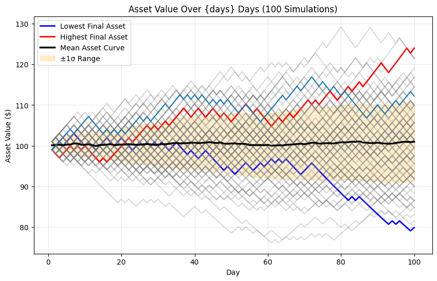

# Monte Carlo Simulation for Sharpe Ratio Analysis

This project simulates a simple probabilistic investment strategy using **Monte Carlo simulation** and evaluates its **Sharpe Ratio** performance.  
It visualizes 100 simulated asset trajectories, highlighting the **highest**, **lowest**, and **mean** paths with ±1σ confidence bands.

---

## 🧩 Project Overview

### Simulation Concept
- Initial capital: **$100**
- Duration: **100 trading days**
- Daily return:
  - +1% with 51% probability  
  - −1% with 49% probability
- The process repeats for:
  - **1000 simulations** (to estimate average Sharpe Ratio)
  - **100 runs** (to visualize asset paths)

---

## ⚙️ Features

✅ Calculate **Daily** and **Annualized Sharpe Ratios**  
✅ Perform **Monte Carlo simulation** to estimate long-term Sharpe Ratio stability  
✅ Visualize 100 independent 100-day simulations  
✅ Highlight:
- 🔴 Highest final asset value
- 🔵 Lowest final asset value
- ⚫ Mean asset trajectory
- 🟠 ±1σ risk envelope (most common outcome range)

---

## 📊 Sharpe Ratio Definition

\[
Sharpe = \frac{E[R] - R_f}{\sigma[R]}
\]

Where:
- \(E[R]\): Average return  
- \(R_f\): Risk-free rate (assumed 0 in this model)  
- \(\sigma[R]\): Standard deviation of returns  

Annualized conversion:
\[
S_{annual} = S_{daily} \times \sqrt{252}
\]

---

## 🧠 Insights from Simulation

- Even with a **slight positive edge (51% win rate)**, the **Sharpe Ratio remains low** (~0.33 annualized).
- A small positive expectation is **not sufficient** for high-quality investment performance.
- Risk control and volatility reduction are key to improving Sharpe Ratio.

---

## 🧪 Example Output

- Average Daily Sharpe Ratio after 1000 simulations: 0.0207
- Average Annual Sharpe Ratio after 1000 simulations: 0.3278
- Highest final asset value: 123.99
- Lowest final asset value: 79.85

✅ The above result ran on 2025/10/25

---

### Sample Plot:

- Gray lines → 100 random simulations  
- Black line → Mean trajectory  
- Orange band → ±1σ range  
- Red / Blue lines → Highest / Lowest final assets  




## 🛠️ How to Run

### Requirements
- Python 3.8+
- Libraries:
  ```bash
  pip install numpy pandas matplotlib

### Execute
```bash
python montecarlo_sharpe_simulation.py
```
#### or you can run the code on Google Colab for skipping install the specific libraries.


## 📈 File Structure
```bash
.
├── montecarlo_sharpe_simulation.py   # Main program
├── README.md                         # Project documentation
└── docs/
    └── example_plot.png               # Sample output figure
```

📚 References

Sharpe, W. F. (1966). Mutual Fund Performance. Journal of Business, 39(1), 119–138.

WorldQuant BRAIN 2025 Quantitative Research Challenge

💡 Author

Developed by [Maton Wang]
Part of the WorldQuant BRAIN 2025 Quant Consultant Accelerator Program.

